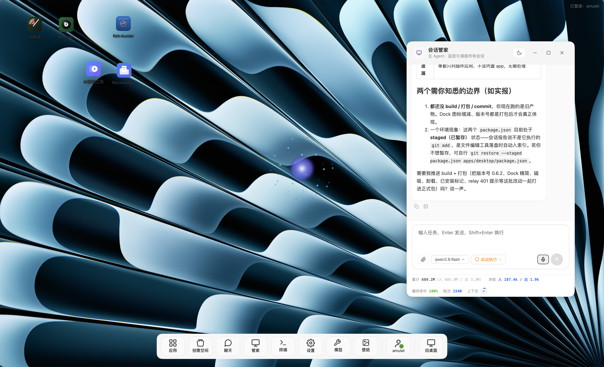
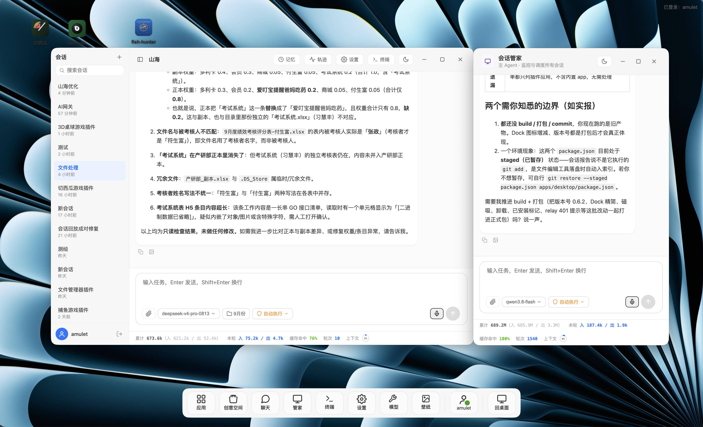
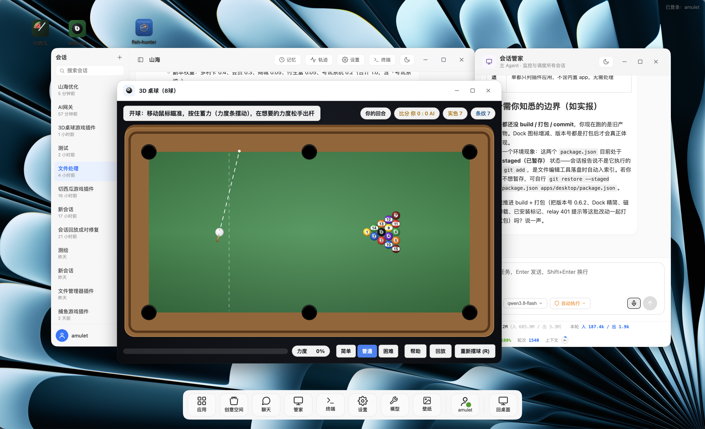

# Shanhai

> A general-purpose desktop multi-Agent assistant —— with a self-built plugin kernel.

[中文](README.md) ｜ English

Shanhai is an agent application that runs on the macOS desktop: multi-expert orchestration, real tool execution, session-level isolation, and self-upgrade. The backend kernel is self-built (providing `ctx`/`inject`/`effect`/`slots`/`fiber` semantics); the frontend is rendered with Electron + React, and there is also a Flutter mobile client.

## Download

- [🪟 Windows download](https://store.bjctykj.com/app-versions/Windows/1789119725_Shanhai-0.6.9-x64.exe) (x64, v0.6.9)
- [🍎 macOS download](https://store.bjctykj.com/app-versions/macOS/1789119766_Shanhai-0.6.9-arm64.dmg) (Apple Silicon / arm64, v0.6.9)

> See the [changelog](CHANGELOG.en.md) for what each version changed.

> The latest version can also be queried through the gateway's public API: `https://aigateway.bjctykj.com/api/v1/app/version/check?type=macOS&arch=arm64` (`type` takes `macOS` / `Windows`; for macOS you also need `arch=arm64`).

## Features

- **Account & password login**: connects to the member gateway `<YOUR_GATEWAY_DOMAIN>` (passwords encrypted with SHA-256); after login it fetches the gateway model list, and it also supports custom OpenAI-compatible endpoints
- **Multi-expert orchestration**: Triage task decomposition + an expert Agent pool (ReAct loop), calling tools for real task execution
- **Session Supervisor scheduling**: one independent, always-on "supervisor" super-session that monitors/forwards all user sessions in a unified way — viewing each session's status (busy/model/approval policy/current request/executed step count/context usage), forwarding messages to any session, and switching any session's model and security mode
- **Tool execution**: read/write files, run commands (with timeout process-group reaping), computer operation (screenshots/OCR/keyboard & mouse via CGEvent), built-in browser automation, persistent terminal
- **Plugin system (K5 self-modification)**: chat-style self-upgrade —— the `plugin_*` toolchain (define/run/stop/undefine/test/install/uninstall/scaffold/build/test_load/verify/inspect) + the unified dispatch entry `plugin_tool` + the app list `plugin_apps`; plugin tools are centrally governed by the Registry and do not pollute the top-level tool table, and the UI can be hot-updated
- **Skills & MCP**: composite skills (built-in + the `~/.shanhai/skills` user skill directory) + an MCP client for connecting external tools (`~/.shanhai/mcp.json`)
- **Security**: approval for dangerous operations (session-level isolation), snapshot rollback before writing files, enforced capability manifest
- **Sessions**: multiple sessions in parallel, persistent event logs, resume from a breakpoint, isolated working directories, isolated input drafts
- **Long-term memory**: cross-session memory (config-type + experience-type) + a memory panel
- **Context compaction**: automatically compacts history into a summary when the token budget is exceeded
- **Voice**: TTS (macOS say) + microphone recording recognition
- **Always-on tray**: closing the window minimizes it to the system tray, and a global shortcut (⌘+Shift+Space) summons/hides the window
- **Member direct messages**: after logging in, exchange one-to-one messages with friends (text, images, file attachments), with unread reminders, an unread divider, right-click copy and quote-to-session, and per-session drafts and window-size memory
- **Message sharing**: the bottom of AI replies and of your own sent-message cards has a one-click share to a chosen friend, sending the whole message in one go
- **Supervisor taking over direct messages**: optionally enabled, friends' incoming messages are answered directly by the session supervisor; before sending, content suspected of being keys or tokens is intercepted
- **Creative Space app updates**: after an author publishes a new version, it can be updated directly in "Discover"; permission changes are confirmed before updating, and the previous version can be restored afterwards
- **Chinese & English UI**: interface copy supports switching between Chinese and English, following the system language or set manually
- **Cloud storage upload**: goes through the gateway upload-token and returns an https link
- **DeepSeek bridge**: wraps the logged-in DeepSeek web version into an OpenAI-compatible `/v1/chat/completions`

## Interface preview

> The following are screenshots of the actual Shanhai desktop interface (source: a local test environment; the images are stored in the repository under `docs/images/`).

### 1. Desktop session and plugin apps



The Shanhai desktop as a whole: at the top left are the icons of installed plugin apps (Fruit Ninja / billiards / fish-hunter / AI Video Studio / file-manager), at the bottom is the floating Dock (apps / Creative Space / chat / supervisor / terminal / settings / models / wallpaper / user / back to desktop), on the right is the "Session Supervisor" window (main Agent · monitoring and scheduling all sessions), and at the bottom right is the message input area with model/context statistics.

### 2. Main session window and multi-session management



The Shanhai main window: on the left is the "sessions" list (searchable, with add-new, showing each session in reverse chronological order), and the main content area on the right shows the inspection results and execution progress of the current session (e.g. "file processing"), with the message input area (including model selection, execution mode, microphone, send button) and token/context statistics at the bottom; the "Session Supervisor" window is also open side by side.

### 3. Plugin window app (3D billiards)



An example of a window app in the Shanhai plugin system: in front is the "3D Billiards (8-ball)" game plugin window (3D pool table, green cloth/brown frame, cue-ball aiming dashed line, power bar, easy/normal/hard difficulty, help/replay/re-rack), and behind it, side by side, are the main session window and the "Session Supervisor" window, demonstrating "plugin app + session management" working together on one screen.

## What Shanhai can do

> Aimed at end users and developers, explaining item by item "what it is, what problem it solves, who it suits". All capabilities correspond to real implementations (`apps/`, `packages/`, the plugin protocol `docs/plugin-protocol.md`), and do not include capabilities that are still planned but not yet landed.

### 1. Multi-session parallelism + Session Supervisor scheduling

**What it is**: Shanhai is a multi-session agent system of "Electron desktop + Flutter mobile", with one independent, always-on "Session Supervisor" acting as the master session that schedules all other sessions in a unified way.

**What problem it solves**:
- Run multiple sessions in parallel on different tasks without interfering with each other (working directory, input drafts, and context are all isolated per session).
- The supervisor monitors, forwards to, and switches between all sessions in a unified way, so you don't have to jump between many windows looking for a task.

**Who it suits**: users who run several tasks in parallel and want a single scheduling entry point.

### 2. Plugin system (everything is a plugin + engineering loop)

**What it is**: Shanhai's kernel follows "everything is a plugin" —— the host, tools, UI, voice, memory, and self-upgrade are all plugins. Plugins come in two kinds, "window apps" and "pure tools", and are developed through an engineering loop: `scaffold → build → test-load → verify → install → uninstall`, with `publish` supported to package and release to the Creative Space.

**What problem it solves**:
- Extend Shanhai's capabilities with plugins without changing the kernel; plugins are developed with the `plugin_*` toolchain and, after `plugin_install`, persist across sessions and restarts.
- Plugins declare `capabilities` (least privilege) and go through an approval flow; out-of-bounds access is intercepted by the kernel.

**Who it suits**: developers who want to build custom capabilities for Shanhai or reuse others' plugins; advanced users who can "self-upgrade" just by chatting.

### 3. File management + computer / browser / terminal automation

**What it is**: real tool execution —— read/write files, run commands (with timeout process-group reaping), computer operation (screenshots/OCR/keyboard & mouse), built-in browser automation (navigate/click/type/extract), persistent terminal (state kept between commands).

**What problem it solves**: lets the agent operate the system directly to complete real tasks rather than only giving text suggestions; the persistent terminal supports continuous execution of multi-step commands.

**Who it suits**: users and developers who need to automate file organization, script execution, web operations, or command-line work.

### 4. AI generation apps

**What it is**: content creation through official plugins and governed media generation capabilities —— AI Video Studio (shortdrama) supports storyboard scripts + AI video generation; inside a plugin window it can directly call governed model capabilities (`listModels` / `modelCall` / `modelCallStream`) and media generation capabilities (`videoGen` / `videoGenQuery` / `imageGen` / `imageGenQuery` / `tts` / `uploadFile`).

**What problem it solves**: "one-click generate" scripts, videos, images, voiceovers, etc. inside a plugin window, avoiding hand-assembled pipelines.

**Who it suits**: content creators, short-drama/video makers. Note: the video generation (`videoGen`) interface is genuinely available; image (`imageGen`) and TTS bridges are currently reserved and depend on the gateway side opening them up gradually.

### 5. Model switching and security modes

**What it is**: supports fetching the gateway model list after login, switching the model used by any session, connecting custom OpenAI-compatible endpoints, and wrapping the logged-in DeepSeek web version into an OpenAI-compatible endpoint (DeepSeek bridge). Security modes have three levels: `ask` (ask every time) / `workdir` (no approval inside the working directory) / `never` (fully automatic).

**What problem it solves**: flexibly choose model by task complexity, cost, and privacy; adjust approval granularity by risk preference.

**Who it suits**: users who care about security, controllability, and model cost/capability.

### 6. Context management and stability

**What it is**: expiry-window display (token usage status bar), context compaction (automatically compacting history into a summary above the threshold), resume from a breakpoint, history replay isolation (historical assistant turns are replayed as-is as standard messages, and the system prompt explicitly states they do not represent this round's result, preventing hallucination), and user-message tags (`&lt;user_query&gt;` marks the user's actual words, distinguishing the current instruction from historical questions by position, preventing old questions from being treated as new tasks).

**What problem it solves**: long conversations/long tasks are not interrupted because the context fills up, can continue from the breakpoint after an interruption, and historical replay is not mistaken for this round's result.

**Who it suits**: users who run long tasks and need reliable resume capability.

### 7. Long-term memory

**What it is**: cross-session memory (config-type + experience-type), with a memory panel for viewing and managing it.

**What problem it solves**: lets the agent remember your preferences, project background, and environment conventions across sessions, so you don't have to explain them again every time.

**Who it suits**: users who use it frequently over the long term and want it to "know you better the more you use it".

### 8. Voice

**What it is**: TTS (macOS `say` speech synthesis) + microphone recording recognition.

**What problem it solves**: voice input and voice playback, improving interaction efficiency.

**Who it suits**: users who prefer voice interaction.

### 9. Skills and MCP extensions

**What it is**: composite skills (built-in + the `~/.shanhai/skills` user skill directory, invoked via `skill_list`/`skill_read`/`skill_run`) + an MCP client for connecting external tools (`~/.shanhai/mcp.json`).

**What problem it solves**: distill reusable flows into skills, or connect third-party MCP tools, expanding the agent's capability surface.

**Who it suits**: users and developers who want to connect external toolchains and distill their own flows.

### 10. Always-on tray + global shortcut + cloud storage

**What it is**: closing the window minimizes it to the system tray; a global shortcut (⌘+Shift+Space) summons/hides the window; cloud storage upload goes through the gateway `upload-token` and returns an `https` link.

**What problem it solves**: stay resident in the background and be summoned at any time; upload local files as public links for others to access or to feed into media generation interfaces.

**Who it suits**: users who need background residency, quick summoning across apps, and file-link sharing.

### 11. Member direct messages and message sharing

**What it is**: one-to-one direct messages between member accounts (text / images / file attachments), connected with session chat —— AI replies and your own sent messages can both be shared to a chosen friend with one click; "supervisor takeover" can optionally be enabled so the session supervisor replies to friends' incoming messages for you.

**What problem it solves**:
- Send conclusions produced in a session directly to a colleague or to your own other account, without copy-pasting.
- Let the supervisor know who to send to: the supervisor can view your friend list (nickname, username, unread count, time of the last message), so you don't have to report IDs yourself.
- Before sending and sharing, content suspected of being keys, tokens, passwords, or encoded data is intercepted, so credentials are not sent by mistake; when intercepted, a readable reason is given.

**Who it suits**: users who need to pass messages across devices or across people, or who want the supervisor to manage direct messages for them.

## Usage scenarios

> Every scenario corresponds to a genuinely achievable workflow, not a conceptual demo.

### Scenario 1: Developer —— developing / installing plugins inside and outside Shanhai

A developer wants to add a new capability to Shanhai (e.g. a custom tool or a dedicated UI window). The flow: read the plugin protocol spec → `plugin scaffold` generates a compilable project → `plugin build` compiles the `dist/` → `plugin test-load` dry-runs → `plugin verify` validates → `plugin install` installs it into the kernel (landing in `~/.shanhai/plugins/`, persisting across sessions and restarts) → when distribution is needed, `plugin publish` packages a shared bundle and submits it to the Creative Space. Throughout, the plugin protocol and engineering toolchain are there to help; no need to hand-write hard-coded code.

### Scenario 2: Everyday office work —— multiple projects in parallel + file browsing/editing + automation scripts

A user pushes several projects forward at once: open one session per project, each with its own working directory; have the agent browse directories, read files, change configs, run builds, and execute scripts. Sessions do not interfere with each other, and the supervisor monitors each session's status in a unified way (busy/idle, current request, executed step count, context usage), so you can switch to the session you need and keep going at any time.

### Scenario 3: Content creation —— AI video / short drama / illustrated-to-video

A creator uses the "AI Video Studio" plugin to build a short-drama workbench: first generate the storyboard script (governed model calls), then generate AI video shot by shot (`videoGen` to submit + `videoGenQuery` to poll progress); images/voiceovers go through the media generation interfaces, and assets are uploaded via `uploadFile` to get a public link before being handed to the video generation interface. Everything is done inside the plugin window, with no manual pipeline assembly.

### Scenario 4: Task delegation —— hand a complex multi-step task to a session, with the supervisor decomposing and supervising

A user throws in a complex multi-step task (e.g. "find and fix a bug, then get the tests passing"). The supervisor decomposes it into subtasks following "split → match → ask → dispatch → report", matches suitable sessions, asks the user for key decisions when necessary, dispatches execution, and finally summarizes and reports. The user only needs to give the goal and does not need to watch every step; the execution trace is visualized as a timeline, so you can review the order and duration of each step at any time.

### Scenario 5: Deep automation —— computer / browser / terminal orchestration

A user needs cross-system automation: first look things up with the built-in browser, then run multi-step commands with the persistent terminal, and operate desktop apps when necessary (screenshots / OCR locating / keyboard & mouse). These capabilities are carried as plugins, and the agent combines and calls them as needed —— suitable for data collection, batch processing, and automating repetitive operations.

### Scenario 6: Model and security controllability —— switching models, custom endpoints, approval policy

A user wants to control cost and risk per task: switch to a cost-effective model for simple tasks and to a flagship model for complex reasoning; connect custom OpenAI-compatible endpoints for private deployment; set the security mode to `ask` so every write operation is confirmed, or to `workdir` so operations inside the working directory skip approval while those outside still ask. Together with the `ask_user` dialog, the user is interrupted precisely when a key decision is needed.

## Plugin ecosystem

Plugins are driven by the "plugin protocol spec" (`docs/plugin-protocol.md`), come in two kinds, "window apps" and "pure tools", are all developed with the `plugin_*` toolchain, and persist across sessions/restarts after `plugin_install`. Currently installed example plugins:

| Plugin | Version | Form | Capabilities |
|------|------|------|------|
| kanban-board | 2.2.0 | Window app | Multi-column task board: create/read/update/delete, search/filter/sort, drag to change columns, local persistence, Markdown export, chart visualization, light and dark themes + theme following; the host half provides the `kanban_export_markdown` / `kanban_chart_stats` tools (called via `plugin_tool`) |
| product-catalog | 1.0.0 | Window app | Two-column product catalog: list + detail linkage, localStorage persistence, theme following; the host half provides the `product_catalog_stats` statistics tool (data bridge) |

## Creative Space (plugin marketplace)

> "Creative Space" is Shanhai's unified entry point for browsing, installing, sharing, and uninstalling plugins, with panels such as "Discover", "Installed", and "My submissions".

- **Download**: browse published apps in the "Discover" panel and click "Download and install" to download the plugin to this machine and install it.
- **Install**: after installation the app appears on this machine (Dock app menu / desktop window) ready to use; for apps already installed locally, returning to the "Discover" panel shows an "Installed" marker and no longer shows the "Download and install" button, avoiding duplicate installation.
- **Share**: after logging in, click "Share / submit an upgraded version for sharing" on a plugin in the "Installed" panel to submit the plugin to the Creative Space for others to use; if you are not logged in, you get a clear "Please log in first" prompt, and share submissions go through gateway authentication.
- **Update**: after an app author publishes a new version, the installed app card in the "Discover" panel is marked "Update available", and clicking "Update" upgrades to the new version; when the server-side version is older than the local one it is marked "Server version is older" and installation is blocked, avoiding accidental downgrades.
- **Confirmation before update**: if the new version requests more capabilities than the installed version, or if the app has extra files in its local directory, the differences are listed before installation and you are asked to confirm; if you disagree, it is not installed and the old version is kept as-is.
- **Restore the previous version**: each update automatically keeps a backup of the pre-update version, and the "Installed" panel can restore to the previous version with one click (there is only one backup, consumed once restored; apps that have never been upgraded on this machine have no backup to restore).
- **Uninstall**: click "Uninstall" on an app in the "Installed" panel, and after a second confirmation it is removed from this machine (uninstall is irreversible).

> Design philosophy: Shanhai's "everything is a plugin" —— capabilities such as computer operation, browser automation, terminal, voice, and memory all exist in plugin form, and the Creative Space is the discovery and distribution entry point for this plugin capability set.

## Directory structure

```
shanhai/
├── apps/
│   ├── desktop/                  # Electron desktop (main/preload/renderer processes)
│   │   ├── src/main/             #   main process: index + runtime + ipc-handlers + push + browser
│   │   ├── src/preload/          #   contextBridge allowlist bridge
│   │   ├── src/host/             #   boot host + RPC dispatch
│   │   └── src/renderer/         #   React renderer (App.tsx composition root + components/)
│   ├── mobile/                   # Flutter mobile (Android)
│   └── runtime/                  # host runtime (bootstrap assembly + cli + supervisor + prompts)
├── packages/
│   ├── kernel/                   # kernel (K1 composition runtime + K2 version + K4 security)
│   ├── kernel-modules/           # module system (K3, both ends)
│   ├── selfmod/                  # K5 self-modification (plugin_* toolchain + vm sandbox + plugin protocol)
│   ├── agent/                    # AgentLoop + Triage orchestration
│   ├── session/                  # sessions (typed event log)
│   ├── approval/                 # approval
│   ├── tools/                    # atomic tools (read/write/run_command + utility)
│   ├── ask/                      # asking the user (ask_user tool)
│   ├── llm/                      # Model interface + provider adapters
│   ├── memory/                   # layered memory
│   ├── voice/                    # voice (STT/TTS)
│   ├── computer-use/             # computer operation (screenshots/OCR/keyboard & mouse)
│   ├── browser-use/              # built-in browser automation (16 tools)
│   ├── llm-gateway/              # model gateway (three-layer routing + fallback)
│   ├── auth/                     # authentication (login/credentials)
│   ├── skills/                   # composite skills (skill_list/skill_read/skill_run)
│   ├── mcp/                      # MCP client (mcp_list_tools/mcp_call)
│   ├── terminal/                 # terminal (node-pty persistent shell)
│   ├── storage/                  # cloud storage upload (via the gateway upload-token)
│   └── deepseek-bridge/          # DeepSeek web version → OpenAI-compatible bridge
└── docs/                         # design docs (including plugin-protocol.md, the authoritative plugin spec)
```

## Build and packaging

```bash
pnpm install          # install dependencies
pnpm -r typecheck     # typecheck the whole project
pnpm -r test          # run tests

# ── Desktop (Electron) ──
pnpm --filter @shanhai/desktop build            # build the desktop app (tsup + vite)
pnpm --filter @shanhai/desktop start            # start the Electron app (dev run)
pnpm --filter @shanhai/desktop dist:mac:arm64   # package macOS arm64 (dmg + zip)
pnpm --filter @shanhai/desktop dist:win         # package Windows x64 (nsis installer + portable)

# ── Mobile (Flutter, Android) ──
cd apps/mobile && flutter build apk --release   # package the Android release APK
```

Artifact output directories:

- Desktop: `apps/desktop/release/`
  - mac: `Shanhai-<version>-arm64.dmg`, `山海-<version>-arm64-mac.zip`
  - win: `Shanhai-<version>-x64-setup.exe`, `Shanhai-<version>-x64-portable.exe`
- Mobile: `apps/mobile/build/app/outputs/flutter-apk/app-release.apk`

> Windows packaging is "cross-packaging on a mac", and the first run needs to download the Windows build of Electron; if the GitHub download is slow, you can first set `ELECTRON_BUILDER_BINARIES_MIRROR=https://npmmirror.com/mirrors/electron-builder-binaries/` to use a mirror.

## Tech stack

- **Language**: TypeScript (strict, whole project)
- **Package management**: pnpm workspace (`apps/*` + `packages/*`)
- **Desktop**: Electron + Vite + React 18 (renderer)
- **Mobile**: Flutter (Android)
- **Build**: tsup (library packages) + vite (renderer)
- **Testing**: vitest (package-level `tests/`)

## Design documents

- [Shanhai system architecture design](docs/山海系统结构设计.md)
- [Shanhai interface contracts and data models](docs/山海接口契约与数据模型.md)
- [Shanhai development plan](docs/山海开发计划.md)
- [Agent design document](docs/智能体设计文档.md)
- [Plugin protocol spec](docs/plugin-protocol.md) (the authoritative contract for plugin development; required reading before an AI develops a plugin)

## License

This project is open source under the [MIT License](LICENSE), allowing free use, modification, copying, and distribution, requiring only that the copyright notice be retained. See the [LICENSE](LICENSE) file in the root directory for details.
